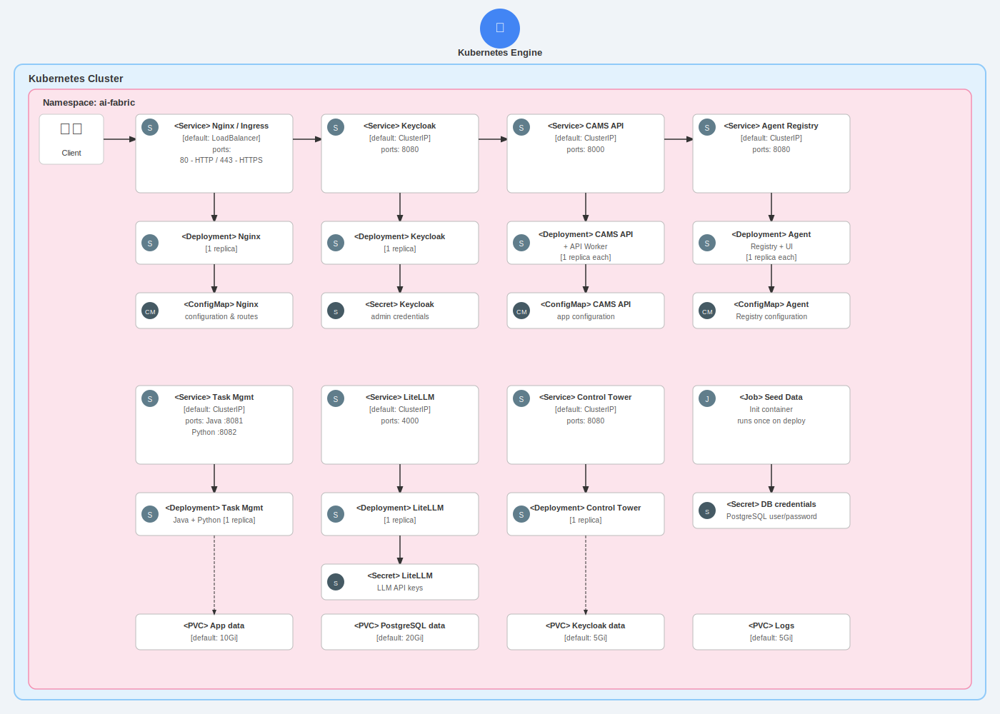

# Overview

CAMS (Cloud Agent Management System) is a comprehensive platform for managing AI agents, authentication, and multi-tenant operations in cloud environments. The system provides enterprise-grade identity management, multi-tenant isolation, and a complete agent lifecycle management platform.

[Learn more about CAMS](https://covasant.io/).


## Architecture



### System Components

The CAMS platform consists of the following microservices:

- **Nginx** - Reverse proxy with SSL/TLS termination and load balancing
- **Keycloak** - Enterprise identity and access management (IAM)
- **PostgreSQL** - Persistent database with pre-seeded data
- **Java Auth Management** - Authentication service with Spring Boot
- **Java Tenant Management** - Multi-tenant management service
- **Python Tenant Management** - Python-based tenant operations
- **CAMS API** - Core API service with background worker
- **Agent Registry API** - Agent management backend
- **Agent Registry UI** - Web-based user interface
- **LiteLLM** - LLM gateway and proxy
- **Control Tower UI** - Administrative dashboard

### Traffic Routing

All external traffic flows through Nginx, which routes requests to internal microservices:

- `/auth/` → Keycloak (Identity Management)
- `/api/auth/` → Java Auth Management
- `/api/v1/auth` → Java Auth Management API
- `/api/tenant/java/` → Java Tenant Management
- `/api/tenant/python/` → Python Tenant Management
- `/api/registry/` → Agent Registry API
- `/registry/` → Agent Registry UI
- `/api/cams/` → CAMS API
- `/` → Agent Registry UI (default)

All services connect to a shared PostgreSQL database for data persistence. The application is designed for internal use within a GKE cluster, with optional external access through the Nginx LoadBalancer.

## Prerequisites

Before deploying CAMS from GCP Marketplace, ensure you have:

1. A Google Cloud Platform (GCP) project with billing enabled
2. A Google Kubernetes Engine (GKE) cluster (recommended: 3+ nodes, n1-standard-2 or higher)
3. Sufficient permissions to deploy applications in your GKE cluster
4. A domain name (required for production use)

# Installation

## Quick install with Google Cloud Marketplace

Get up and running with a few clicks! Install this CAMS app to a Google Kubernetes Engine cluster using Google Cloud Marketplace. Follow the [on-screen instructions](https://console.cloud.google.com/marketplace/details/covasant/cams).

## Command line instructions

You can use [Google Cloud Shell](https://cloud.google.com/shell/) or a local workstation to complete the steps below.

### Prerequisites

#### Set up command-line tools

You'll need the following tools in your development environment. If you are using Cloud Shell, `gcloud`, `kubectl`, Docker and Git are installed in your environment by default.

- [gcloud](https://cloud.google.com/sdk/gcloud/)
- [kubectl](https://kubernetes.io/docs/reference/kubectl/overview/)
- [docker](https://docs.docker.com/install/)
- [git](https://git-scm.com/book/en/v2/Getting-Started-Installing-Git)
- [helm](https://helm.sh/)

Configure `gcloud` as a Docker credential helper:

```shell
gcloud auth configure-docker
```

#### Create a Google Kubernetes Engine cluster

Create a new cluster from the command line:

```shell
export CLUSTER=cams-cluster
export ZONE=us-west1-a

gcloud container clusters create "$CLUSTER" --zone "$ZONE"
```

Configure `kubectl` to connect to the new cluster:

```shell
gcloud container clusters get-credentials "$CLUSTER" --zone "$ZONE"
```

#### Clone this repo

Clone this repo and the associated tools repo:

```shell
git clone --recursive https://github.com/covasant/cams-marketplace.git
```

#### Install the Application resource definition

An Application resource is a collection of individual Kubernetes components, such as Services, Deployments, and so on, that you can manage as a group.

To set up your cluster to understand Application resources, run the following command:

```shell
kubectl apply -f "https://raw.githubusercontent.com/GoogleCloudPlatform/marketplace-k8s-app-tools/master/crd/app-crd.yaml"
```

You need to run this command once.

The Application resource is defined by the [Kubernetes SIG-apps](https://github.com/kubernetes/community/tree/master/sig-apps) community. The source code can be found on [github.com/kubernetes-sigs/application](https://github.com/kubernetes-sigs/application).

### Install the Application

Navigate to the `cams` directory:

```shell
cd cams-marketplace/k8s/cams
```

#### Configure the app with environment variables

Choose an instance name and [namespace](https://kubernetes.io/docs/concepts/overview/working-with-objects/namespaces/) for the app. In most cases, you can use the `default` namespace.

```shell
export APP_INSTANCE_NAME=cams-1
export NAMESPACE=default
```

Configure your domain name:

```shell
export BASE_DOMAIN="example.com"
```

Set SSL certificate option:

```shell
# Set to true for self-signed certificates (testing)
# Set to false for production with your own certificates
export USE_SELF_SIGNED_CERT=true
```

For the persistent disk provisioning of PostgreSQL, you will need to:

* Set the StorageClass name. Check your available options using the command below:
  * ```kubectl get storageclass```
  * Or check how to create a new StorageClass in [Kubernetes Documentation](https://kubernetes.io/docs/concepts/storage/storage-classes/#the-storageclass-resource)

* Set the persistent disk's size. The default disk size is "20Gi".

```shell
export STORAGE_CLASS="standard" # provide your StorageClass name if not "standard"
export PERSISTENT_DISK_SIZE="20Gi"
```

Set the number of replicas for services:

```shell
export KEYCLOAK_REPLICAS=1
export NGINX_REPLICAS=1
export CAMS_API_REPLICAS=1
```

Set up the image tag:

It is advised to use stable image reference which you can find on Marketplace Container Registry.

```shell
export TAG="1.0"
```

Configure the container images:

```shell
export IMAGE_KEYCLOAK="marketplace.gcr.io/covasant/cams/keycloak"
export IMAGE_POSTGRESQL="marketplace.gcr.io/covasant/cams/postgresql"
export IMAGE_NGINX="marketplace.gcr.io/covasant/cams/nginx"
export IMAGE_JAUTH="marketplace.gcr.io/covasant/cams/java-auth"
export IMAGE_JTMGMT="marketplace.gcr.io/covasant/cams/java-tenant"
export IMAGE_PYTMGMT="marketplace.gcr.io/covasant/cams/python-tenant"
export IMAGE_CAMSAPI="marketplace.gcr.io/covasant/cams/cams-api"
export IMAGE_AGENTREGISTRY="marketplace.gcr.io/covasant/cams/agent-registry-api"
export IMAGE_AGENTREGISTRYUI="marketplace.gcr.io/covasant/cams/agent-registry-ui"
export IMAGE_LITELLM="marketplace.gcr.io/covasant/cams/litellm"
export IMAGE_CONTROLTOWER="marketplace.gcr.io/covasant/cams/control-tower"
```

#### Create the namespace in your Kubernetes cluster

If you use a different namespace than the `default`, run the command below to create a new namespace:

```shell
kubectl create namespace "$NAMESPACE"
```

#### Expand the manifest template

Use `helm template` to expand the template. We recommend that you save the expanded manifest file for future updates to the application.

```shell
helm template chart/cams \
  --name "${APP_INSTANCE_NAME}" \
  --namespace "${NAMESPACE}" \
  --set app.baseDomain="${BASE_DOMAIN}" \
  --set app.useSelfSignedCert="${USE_SELF_SIGNED_CERT}" \
  --set postgresql.persistence.storageClass="${STORAGE_CLASS}" \
  --set postgresql.persistence.size="${PERSISTENT_DISK_SIZE}" \
  --set keycloak.replicas="${KEYCLOAK_REPLICAS}" \
  --set nginx.replicas="${NGINX_REPLICAS}" \
  --set camsapi.replicas="${CAMS_API_REPLICAS}" \
  > "${APP_INSTANCE_NAME}_manifest.yaml"
```

#### Apply the manifest to your Kubernetes cluster

Use `kubectl` to apply the manifest to your Kubernetes cluster:

```shell
kubectl apply -f "${APP_INSTANCE_NAME}_manifest.yaml" --namespace "${NAMESPACE}"
```

#### View the app in the Google Cloud Console

To get the GCP Console URL for your app, run the following command:

```shell
echo "https://console.cloud.google.com/kubernetes/application/${ZONE}/${CLUSTER}/${NAMESPACE}/${APP_INSTANCE_NAME}"
```

To view your app, open the URL in your browser.

### Access the Application

#### Configure DNS

After deployment, get the external IP address of the Nginx LoadBalancer:

```shell
NGINX_IP=$(kubectl get svc ${APP_INSTANCE_NAME}-nginx-ingress \
  --namespace ${NAMESPACE} \
  --output jsonpath='{.status.loadBalancer.ingress[0].ip}')

echo $NGINX_IP
```

Create an A record in your DNS provider:

```
aifabric.example.com  →  ${NGINX_IP}
```

Or use a wildcard record:

```
*.example.com  →  ${NGINX_IP}
```

#### Access the UI

Once DNS propagates, access the application at:

```
https://aifabric.${BASE_DOMAIN}
```

## SSL Certificate Configuration

### Option 1: Self-Signed Certificates (Default)

When `app.useSelfSignedCert` is set to `true`, the application automatically generates self-signed SSL certificates during deployment.

**Note**: Self-signed certificates will trigger browser warnings. This option is suitable for:
- Development environments
- Testing
- Internal networks

### Option 2: Custom SSL Certificates (Production)

For production deployments with your own SSL certificates (from GoDaddy, Let's Encrypt, or other CA):

#### Before Deployment

1. Set `app.useSelfSignedCert` to `false` during marketplace configuration

#### After Deployment

2. Create a Kubernetes TLS secret with your certificate and private key:

```bash
kubectl create secret tls <release-name>-tls-secret \
  --cert=path/to/your/certificate.crt \
  --key=path/to/your/private.key \
  -n <namespace>
```

**Important**: The secret name must follow the pattern `<release-name>-tls-secret` where `<release-name>` is the application name you chose during deployment.

3. Restart the Nginx deployment to load the new certificates:

```bash
kubectl rollout restart deployment/<release-name>-nginx -n <namespace>
```

#### Certificate Requirements

Your SSL certificate must:
- Be valid and not expired
- Match your domain name (CN or SAN)
- Include the full certificate chain (if using intermediate certificates)
- Be in PEM format

#### Example: Using Let's Encrypt with Cert-Manager

If you're using cert-manager for Let's Encrypt certificates:

1. Install cert-manager in your cluster
2. Create a Certificate resource:

```yaml
apiVersion: cert-manager.io/v1
kind: Certificate
metadata:
  name: <release-name>-tls
  namespace: <namespace>
spec:
  secretName: <release-name>-tls-secret
  issuerRef:
    name: letsencrypt-prod
    kind: ClusterIssuer
  dnsNames:
    - aifabric.example.com
```

3. Cert-manager will automatically create and renew the secret

## Custom Domain Configuration

### Keycloak Custom Hostname

To use a custom domain for Keycloak (e.g., `auth.example.com`):

1. Set the `keycloak.hostname` parameter during deployment or update the values:

```bash
kubectl edit configmap <release-name>-keycloak-config -n <namespace>
```

2. Add DNS record:
```
auth.example.com  →  <NGINX-EXTERNAL-IP>
```

3. Update your SSL certificate to include the custom hostname

### Check the status of the CAMS deployment

If your deployment is successful, you can check the status of your CAMS cluster.

Check all pods are running:

```shell
kubectl get pods --namespace "${NAMESPACE}" -l app.kubernetes.io/name=cams
```

Check the status of services:

```shell
kubectl get svc --namespace "${NAMESPACE}" -l app.kubernetes.io/name=cams
```

View logs for specific components:

```shell
# Nginx logs
kubectl logs -f deployment/${APP_INSTANCE_NAME}-nginx --namespace "${NAMESPACE}"

# Keycloak logs
kubectl logs -f deployment/${APP_INSTANCE_NAME}-keycloak --namespace "${NAMESPACE}"

# CAMS API logs
kubectl logs -f deployment/${APP_INSTANCE_NAME}-camsapi --namespace "${NAMESPACE}"
```

### Connecting to CAMS (internal access)

You can connect to CAMS services without exposing your cluster for external access, using the following options:

* From a container in your Kubernetes cluster, connect using the service hostname:
  * `${APP_INSTANCE_NAME}-nginx.${NAMESPACE}.svc.cluster.local`

* Use port forwarding to access the service. In a separate terminal, run the following command:

  ```shell
  kubectl port-forward svc/${APP_INSTANCE_NAME}-nginx 8443:443 --namespace "${NAMESPACE}"
  ```

  Then access the application at `https://localhost:8443`

# Scaling the CAMS app

### Scaling services up

By default, most CAMS services are deployed using 1 replica. To change the number of replicas, use the following command:

```shell
kubectl scale deployment ${APP_INSTANCE_NAME}-nginx \
  --namespace "${NAMESPACE}" --replicas=3
```

You can scale individual services:

```shell
# Scale Keycloak
kubectl scale deployment ${APP_INSTANCE_NAME}-keycloak \
  --namespace "${NAMESPACE}" --replicas=3

# Scale CAMS API
kubectl scale deployment ${APP_INSTANCE_NAME}-camsapi \
  --namespace "${NAMESPACE}" --replicas=3

# Scale Agent Registry API
kubectl scale deployment ${APP_INSTANCE_NAME}-agentregistry \
  --namespace "${NAMESPACE}" --replicas=3
```

For more information about scaling Deployments, see the [Kubernetes documentation](https://kubernetes.io/docs/concepts/workloads/controllers/deployment/#scaling-a-deployment).

# Backup and restore

### Backing up your PostgreSQL data

These steps back up your CAMS PostgreSQL database.

Set your installation name and Kubernetes namespace:

```shell
export APP_INSTANCE_NAME=cams-1
export NAMESPACE=default
```

Get the PostgreSQL pod name:

```shell
POSTGRESQL_POD=$(kubectl get pods --namespace ${NAMESPACE} \
  -l app.kubernetes.io/name=cams,component=postgresql \
  -o jsonpath='{.items[0].metadata.name}')
```

Create a backup:

```shell
kubectl exec ${POSTGRESQL_POD} --namespace ${NAMESPACE} -- \
  pg_dumpall -U postgres > cams-backup-$(date +%Y%m%d-%H%M%S).sql
```

This creates a backup file with timestamp in your current directory.

### Restoring the PostgreSQL data

Set your installation name and Kubernetes namespace:

```shell
export APP_INSTANCE_NAME=cams-1
export NAMESPACE=default
```

Get the PostgreSQL pod name:

```shell
POSTGRESQL_POD=$(kubectl get pods --namespace ${NAMESPACE} \
  -l app.kubernetes.io/name=cams,component=postgresql \
  -o jsonpath='{.items[0].metadata.name}')
```

Restore from backup file:

```shell
kubectl exec -i ${POSTGRESQL_POD} --namespace ${NAMESPACE} -- \
  psql -U postgres < cams-backup-YYYYMMDD-HHMMSS.sql
```

Replace `YYYYMMDD-HHMMSS` with your actual backup file timestamp.

# Uninstall the Application

## Using the Google Cloud Platform Console

1. In the GCP Console, open [Kubernetes Applications](https://console.cloud.google.com/kubernetes/application).

1. From the list of applications, click **CAMS**.

1. On the Application Details page, click **Delete**.

## Using the command line

### Prepare the environment

Set your installation name and Kubernetes namespace:

```shell
export APP_INSTANCE_NAME=cams-1
export NAMESPACE=default
```

### Delete the resources

> **NOTE:** We recommend using a `kubectl` version that is the same as the version of your cluster. Using the same versions of `kubectl` and the cluster helps avoid unforeseen issues.

To delete the resources, use the expanded manifest file used for the installation.

Run `kubectl` on the expanded manifest file:

```shell
kubectl delete -f ${APP_INSTANCE_NAME}_manifest.yaml --namespace ${NAMESPACE}
```

If you don't have the expanded manifest, delete the resources using types and a label:

```shell
kubectl delete application,deployment,statefulset,service,configmap,secret \
  --namespace ${NAMESPACE} \
  --selector app.kubernetes.io/name=cams
```

### Delete the PersistentVolumeClaims

By design, the removal of StatefulSets in Kubernetes does not remove PersistentVolumeClaims that were attached to their Pods. This prevents your installations from accidentally deleting stateful data.

To remove the PersistentVolumeClaims with their attached persistent disks, run the following `kubectl` commands:

```shell
for pv in $(kubectl get pvc --namespace ${NAMESPACE} \
  --selector app.kubernetes.io/name=cams \
  --output jsonpath='{.items[*].spec.volumeName}');
do
  kubectl delete pv/$pv --namespace ${NAMESPACE}
done

kubectl delete persistentvolumeclaims \
  --namespace ${NAMESPACE} \
  --selector app.kubernetes.io/name=cams
```

### Delete the GKE cluster

Optionally, if you don't need the deployed application or the GKE cluster, delete the cluster using this command:

```shell
gcloud container clusters delete "$CLUSTER" --zone "$ZONE"
```
